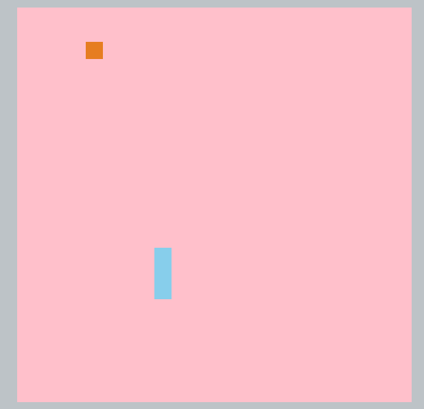

# Week10 Rust Project (Jinghuai Zhang)

This project builds a simple snake game for user to play with using Rust. In particular, I learn a lot about how to build user interaction module in Rust through this project.

To play the game on a weight*height (e.g., 25*25) board, simply run the following command:

``RUST_BACKTRACE=full cargo run -- --width 25 --height 25``

Sample output:

