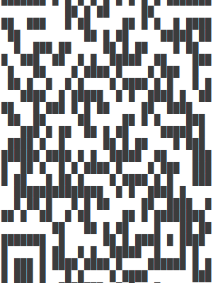

# Week11 Rust Project (Jinghuai Zhang)

This project builds a program to generate a QR code for an input image, which helps to generate a watermark to protect the intellectual property of any image. (e.g. generated by ChatGPT)

Simply run the following command:

``cargo run``

Sample output:

