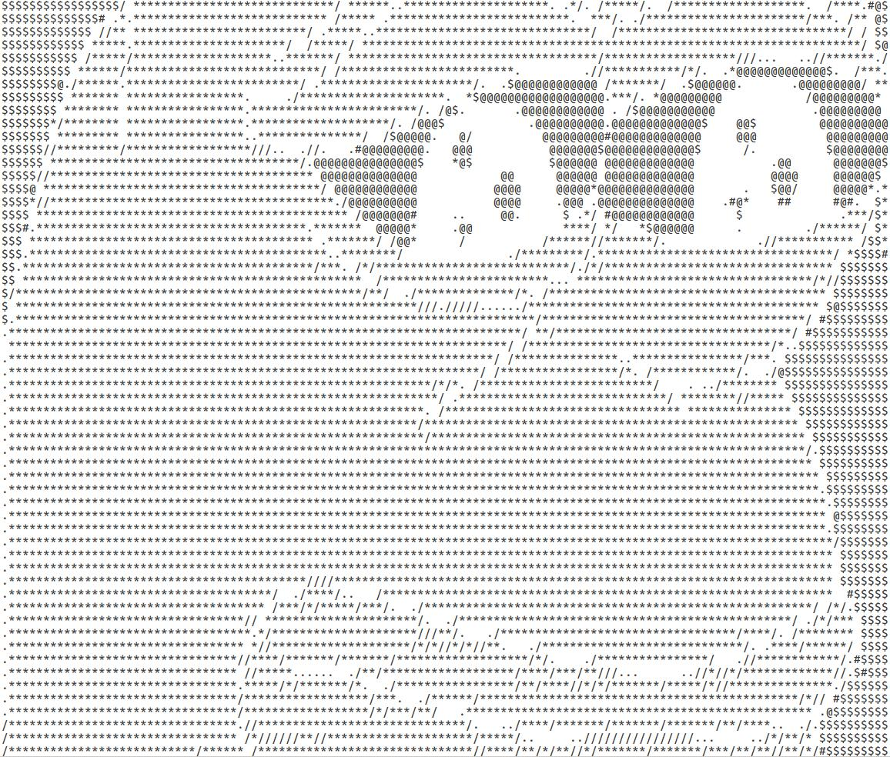

# Week7 Rust Project (Jinghuai Zhang)

This project aims to convert an input image into ascii.

In particular, users need to edit the path to image file in line 49 of the main.rs file. And then run the codebase as follows: 

``RUST_BACKTRACE=full cargo run``

The result will be saved in "result.txt". For example:

Input:

Output:

