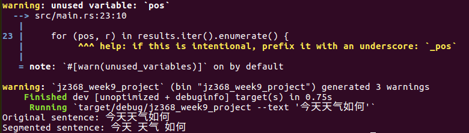

# Week9 Rust Project (Jinghuai Zhang)

This project aims to build a mini service to promote the understanding of Chinese sentence. In particular, the program can segment an input Chinese sentence into several meaningful pieces with the help of Chinese-dictionary library.

In particular, users can use the following command to segment an input sentence (e.g., 今天天气如何 (What's the weather today?)):

``cargo run -- --text 今天天气如何``

Sample output:

